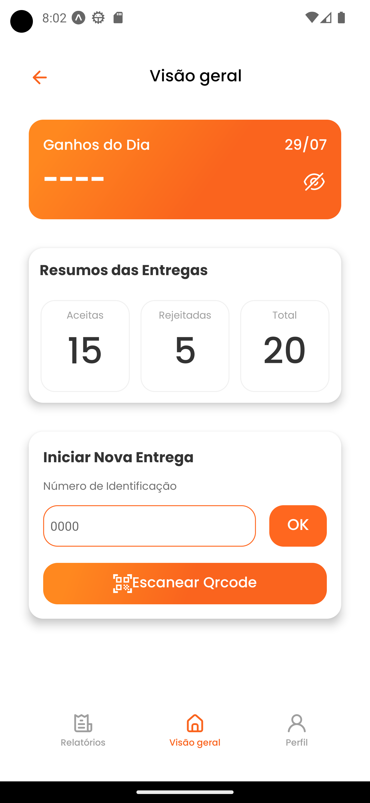
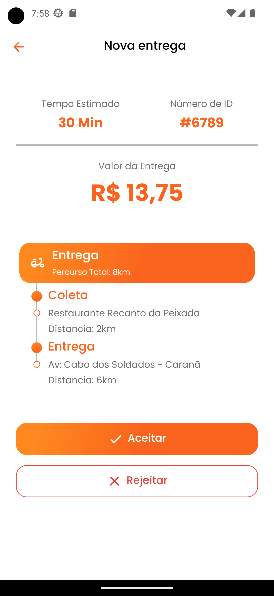

<h1 align="center">Pigz couriers</h1>

## Indexes

- [About](#about)
- [Built In](#built_in)
- [Libraries](#libraries)
- [Preview](#preview)
   

## About 

Application created in the job selection process for Software Engineer specialized in React. Mobile version in React-Native.
Conceptual project link [xd.abode.com/...](https://xd.adobe.com/view/aa9d5857-660a-48ea-82e0-cf7766754949-ffce/screen/94be1417-76a6-40c7-b704-ed813b104f4d/specs/)

###### Run App

Start the project with <code>npm install</code>
After that run npm command <code>npm run android</code>

 

## Built in 

- JAVA-SCRIPT
- REACT-NATIVE

## Libraries 

- Expo 47.0
  - Expo Font 11.0
    - Expo Google Fonts Poppins 0.2
  - Expo React Navigation/native 6.1
    - React Navigation/native-stack 6.9
  - Expo Status Bar 1.4
  - Expo Splash Screen 0.17
  - Expo Linear Gradient 12.0
- React 18.1
- React Native 0.70
  - React Native Safe Area Context 4.4
  - React Native Screens 3.18
  - React Native Svg 13.4
  - React Native Svg Transformer 1.0

 

## Preview 

  
  
  
  
  

